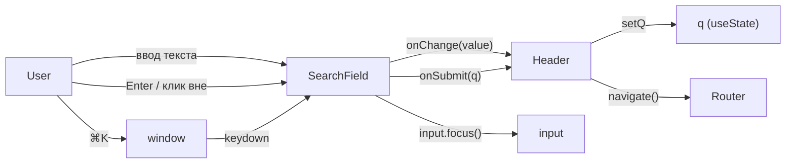

# План рефакторинга: вынос поиска из Header в SearchField

## Мотивация

Текущий `Header` нарушает SRP — содержит инлайн-разметку поискового поля, его стили и логику `⌘K`. Поле не обёрнуто в `<form>`, что снижает доступность и не позволяет нативному сабмиту по Enter.

## Что делаем

1. Создаём компонент `SearchField` внутри `widgets/header/`
2. Оборачиваем поиск в `<form>` с `onSubmit`
3. Добавляем поддержку `⌘K` / `Ctrl+K` для фокуса поля
4. Заменяем инлайн-код в `Header` на `SearchField`
5. Переносим соответствующие стили

## Новая структура

```
src/widgets/header/
├── index.ts                          # export { Header } — без изменений
└── ui/
    ├── Header/
    │   ├── index.tsx                 # ← замена инлайн-поиска на <SearchField>
    │   └── Header.module.css         # ← удалить .searchBox, .searchInput, .searchHint
    ├── NavPill/
    ├── IconButton/
    └── SearchField/                  # ★ новый компонент
        ├── index.tsx
        └── SearchField.module.css
```

## Спецификация SearchField

### Пропсы

```ts
type SearchFieldProps = {
  value: string
  onChange: (value: string) => void
  onSubmit: (value: string) => void
  placeholder?: string
}
```

### Поведение

- Рендерит `<form onSubmit={handleSubmit}>`
- Внутри: `SearchIcon`, `<input>`, хинт `⌘K`
- `handleSubmit` вызывает `event.preventDefault()` и `onSubmit(value)`
- `useEffect` с глобальным слушателем `keydown` для `⌘K` / `Ctrl+K` — фокусирует инпут
- Компонент **controlled** — состояние `q` остаётся в `Header`

### Стили (SearchField.module.css)

Переносятся из `Header.module.css`:
- `.searchBox` → `.field`
- `.searchInput` → `.input`
- `.searchHint` → `.hint`

Плюс добавляется `form { display: contents }` (чтобы не ломать грид-раскладку).

## Изменения в Header

### Было

```tsx
const [q, setQ] = useState('')

// в JSX:
<div className={s.searchBox}>
  <SearchIcon />
  <input value={q} onChange={(e) => setQ(e.target.value)} ... />
  <span className={s.searchHint}>⌘K</span>
</div>
```

### Стало

```tsx
const [q, setQ] = useState('')

// в JSX:
<SearchField
  value={q}
  onChange={setQ}
  onSubmit={(q) => navigate(`/search?q=${encodeURIComponent(q)}`)}
/>
```

### Удаляемые стили из Header.module.css

`.searchBox`, `.searchInput`, `.searchHint` — полностью переезжают в `SearchField.module.css`.

## Поток данных



## Порядок выполнения (для Code mode)

1. Создать `src/widgets/header/ui/SearchField/SearchField.module.css` — стили поля
2. Создать `src/widgets/header/ui/SearchField/index.tsx` — компонент
3. Обновить `src/widgets/header/ui/Header/index.tsx` — импорт и замена
4. Обновить `src/widgets/header/ui/Header/Header.module.css` — удалить перенесённые стили
5. Проверить `make check` (type-check + lint + build)

## Что НЕ делаем

- Не меняем public API `widgets/header/index.ts` — `SearchField` остаётся внутренним компонентом
- Не трогаем `MobileHeader` — он использует другой паттерн (триггер-плейсхолдер, не поле ввода)
- Не добавляем API-запрос — поиск только навигирует на `/search?q=...`